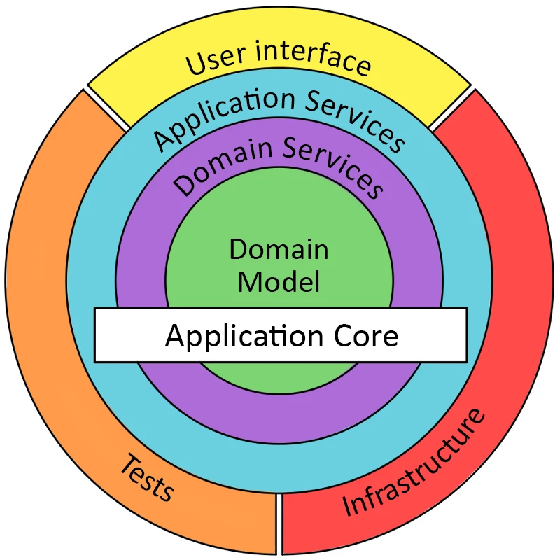

Один из лучших способов повысить эффективность работы — применить шаблон проектирования CQRS.
Существует три вида паттерна CQRS: 
- Regular
- Progressive
- Deluxe

### Классический Onion
Чтобы было понятно, для чего нужен паттерн CQRS, сначала рассмотрим, как выглядит классическая архитектура приложения.
Классическая «луковая» архитектура состоит из нескольких слоев:

-    Доменный слой — наши сущности и классы.
-    Слой бизнес-логики, где происходит вся обработка доменной логики.
-    Слой приложения — логика самого приложения.
-    Внешние слои: слой UI, базы данных или тестов.



## CQRS (Command Query Responsibility Segregation) 
CQRS — это шаблон проектирования, который разделяет операции на две категории:
-    команды — изменяют состояние системы;
-    запросы — не изменяют состояние, только получают данные.

Это паттерн проектирования. В разных компаниях этот паттерн используют по-разному, мы используем его в нашей команде «Выберу.ру», чтобы решить нескольких задач:
-    повысить скорость разработки нового функционала без ущерба для существующего;
-    снизить время подключения нового работника к проекту;
-    уменьшить количество багов;
-    упростить написание тестов;
-    повысить качество планирования разработки.

Благодаря CQRS мы получаем архитектуру, в которой все аккуратно разложено и понятно (меньше связанность, больше связности), человек может открыть код команды или запроса, увидеть все его зависимости, понять, что он делает, и продолжать работать над ним в рамках только этой команды/запроса, без копания в других частях программы.

Понадобятся еще две библиотеки:
-    MediatR — небольшая библиотека, помогающая реализовать паттерн Mediator, который нам позволит производить обмен сообщениями между контроллером и запросами/командами без зависимостей.
-    FluentValidation — небольшая библиотека валидации для .NET, которая использует Fluent-интерфейс и лямбда-выражения для построения правил валидации.
```c#
dotnet add package MediatR.Extensions.Microsoft.DependencyInjection
```
Далее зарегистрируем все компоненты нашей библиотеки в методе ConfigureServices класса Startup:
```c#
 public class Startup
   {
       ...
       public void ConfigureServices(IServiceCollection services)
       {
           ...
           services.AddMediatR(Assembly.GetExecutingAssembly());
           services.AddControllers();
           ...
       }
   }
   ```
   После мы напишем первую команду, пусть это будет команда добавления нового продукта в нашу базу анных. Сначала реализуем интерфейс команды, отнаследовавшись от встроенного в MediatR интерфейса IRequest<TResponse>, в нем мы опишем параметры команды и что она будет возвращать.

   После мы напишем первую команду, пусть это будет команда добавления нового продукта в нашу базу анных. Сначала реализуем интерфейс команды, отнаследовавшись от встроенного в MediatR интерфейса IRequest<TResponse>, в нем мы опишем параметры команды и что она будет возвращать.
   ```c#
   public class AddProductCommand : IRequest
   {
       /// 
       ///     Алиас продукта
       /// 
       public string Alias { get; set; }

       /// 
       ///     Название продукта
       /// 
       public string Name { get; set; }

       /// 
       ///     Тип продукта
       /// 
       public ProductType Type { get; set; }
   }
   ```
Далее нам нужно реализовать обработчик нашей команды с помощью IRequestHandler<TCommand, TResponse>. 

В конструкторе обработчика мы объявляем все зависимости, которые нужны нашей команде, и пишем бизнес-логику, в этом случае - сохранение сущности в БД.
```c#
public class AddProductCommandHandler : IRequestHandler<AddProductCommand, Product>
{
    private readonly IProductsRepository _productsRepository;

    public AddProductCommandHandler(IProductsRepository productsRepository)
    {
        _productsRepository = productsRepository ?? throw new ArgumentNullException(nameof(productsRepository));
    }

    public async Task Handle(AddProductCommand command, CancellationToken cancellationToken)
    {
        Product product = new Product();
        product.Alias = command.Alias;
        product.Name = command.Name;
        product.Type = command.Type;

        await _productsRepository.Add(product);
        return product;
    }
}
```       