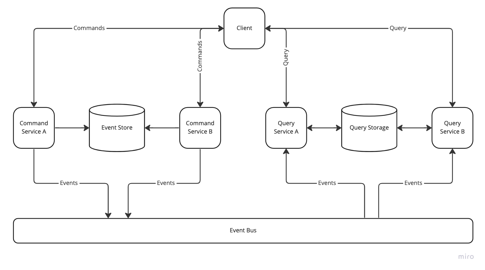

# CQRS
***CQRS*** расшифровывается как Command and Query Responsibility Segregation. Это шаблон, который разделяет операции чтения (Query) и обновления (Command) для хранилища данных. Разделяя операции на Command и Query мы можем максимизировать производительность, масштабируемость и безопасность наших сервисов. Также это увеличивает гибкость всей системы. Для Command и Query сервисов мы можем выбирать разные фреймворки, языки программирования, базы данных. Например, мы могли бы хранить/обновлять данные в реляционной БД, а делать запросы в графовой БД.

Один из лучших способов повысить эффективность работы — применить шаблон проектирования CQRS.
Существует три вида паттерна CQRS: 
- Regular
- Progressive
- Deluxe

### Классический Onion
Чтобы было понятно, для чего нужен паттерн CQRS, сначала рассмотрим, как выглядит классическая архитектура приложения.
Классическая «луковая» архитектура состоит из нескольких слоев:

-    Доменный слой — наши сущности и классы.
-    Слой бизнес-логики, где происходит вся обработка доменной логики.
-    Слой приложения — логика самого приложения.
-    Внешние слои: слой UI, базы данных или тестов.


## CQRS (Command Query Responsibility Segregation) 
CQRS — это шаблон проектирования, который разделяет операции на две категории:
-    команды — изменяют состояние системы;
-    запросы — не изменяют состояние, только получают данные.

Это паттерн проектирования. В разных компаниях этот паттерн используют по-разному, мы используем его в нашей команде «Выберу.ру», чтобы решить нескольких задач:
-    повысить скорость разработки нового функционала без ущерба для существующего;
-    снизить время подключения нового работника к проекту;
-    уменьшить количество багов;
-    упростить написание тестов;
-    повысить качество планирования разработки.

Благодаря CQRS мы получаем архитектуру, в которой все аккуратно разложено и понятно (меньше связанность, больше связности), человек может открыть код команды или запроса, увидеть все его зависимости, понять, что он делает, и продолжать работать над ним в рамках только этой команды/запроса, без копания в других частях программы.

Понадобятся еще две библиотеки:
-    MediatR — небольшая библиотека, помогающая реализовать паттерн Mediator, который нам позволит производить обмен сообщениями между контроллером и запросами/командами без зависимостей.
-    FluentValidation — небольшая библиотека валидации для .NET, которая использует Fluent-интерфейс и лямбда-выражения для построения правил валидации.
```c#
dotnet add package MediatR.Extensions.Microsoft.DependencyInjection
```
Далее зарегистрируем все компоненты нашей библиотеки в методе ConfigureServices класса Startup:
```c#
 public class Startup
   {
       ...
       public void ConfigureServices(IServiceCollection services)
       {
           ...
           services.AddMediatR(Assembly.GetExecutingAssembly());
           services.AddControllers();
           ...
       }
   }
   ```
   После мы напишем первую команду, пусть это будет команда добавления нового продукта в нашу базу анных. Сначала реализуем интерфейс команды, отнаследовавшись от встроенного в MediatR интерфейса IRequest<TResponse>, в нем мы опишем параметры команды и что она будет возвращать.

   После мы напишем первую команду, пусть это будет команда добавления нового продукта в нашу базу анных. Сначала реализуем интерфейс команды, отнаследовавшись от встроенного в MediatR интерфейса IRequest<TResponse>, в нем мы опишем параметры команды и что она будет возвращать.
   ```c#
   public class AddProductCommand : IRequest
   {
       /// 
       ///     Алиас продукта
       /// 
       public string Alias { get; set; }

       /// 
       ///     Название продукта
       /// 
       public string Name { get; set; }

       /// 
       ///     Тип продукта
       /// 
       public ProductType Type { get; set; }
   }
   ```
Далее нам нужно реализовать обработчик нашей команды с помощью IRequestHandler<TCommand, TResponse>. 

В конструкторе обработчика мы объявляем все зависимости, которые нужны нашей команде, и пишем бизнес-логику, в этом случае - сохранение сущности в БД.
```c#
public class AddProductCommandHandler : IRequestHandler<AddProductCommand, Product>
{
    private readonly IProductsRepository _productsRepository;

    public AddProductCommandHandler(IProductsRepository productsRepository)
    {
        _productsRepository = productsRepository ?? throw new ArgumentNullException(nameof(productsRepository));
    }

    public async Task Handle(AddProductCommand command, CancellationToken cancellationToken)
    {
        Product product = new Product();
        product.Alias = command.Alias;
        product.Name = command.Name;
        product.Type = command.Type;

        await _productsRepository.Add(product);
        return product;
    }
}
```       

# Event Sourcing
***Event Sourcing*** — это архитектурный шаблон, подход для хранения данных в виде событий. В традиционном подходе мы храним конечное состояние. Event Sourcing — это кардинально иной подход. Вместо хранения конечного состояния, мы храним все промежуточные состояния в виде событий. Конечное состояние получаем последовательным применением всех промежуточных состояний. Хранилище данных реализуется как неизменяемый журнал только для добавления, и как правило, именуется отдельно как **Event Store**.

# Event Sourcing + CQRS

 Event Sourcing в качестве хранилища данных использует структуру типа «журнал». Мы можем только добавлять события в конец, а изменять и удалять события не можем. Тут важно подчеркнуть, мы можем хранить в Event Store только события, другие структуры шаблоном не предусмотрены. События Event Sourcing — это события предметной области, которые уже произошли в какой-то момент в прошлом
```c#
class OrderItemAddedEvent {
    String orderId;
    String userId;
    String itemId;
    long timestamp;
}
```

Конечное решение может выглядеть так:

 

-    Client — клиент наших сервисов (пользовательский интерфейс, внешний/внутренний сервис).

-    Commands — команды в определении CQRS, операции, результат которых приводит к созданию событий в Event Store.

-    Command Service A — сервис или группа сервисов, которые обслуживают команды определенных типов. Например, сервис заказов.

-    Command Service B — другой сервис команд.

-    Event Store — хранилище событий. Например, MongoDB, PostgreSQL, Apache Cassandra, Redis. Главная характеристика при выборе Event Store — это производительность добавления записи.

-    Events — события.

-    Event Bus — шина событий. Например, Apache Kafka, Redis, RabbitMQ.

-    Query — команда - запрос на получение агрегированных данных.

-    Query Service A — сервис или группа сервисов, которые обслуживают запросы определенных типов. Например, история заказов.

-    Query Service B — другой сервис запросов.

-    Query Storage — хранилище агрегированных данных, оптимальных для запросов. Тут для двух сервисов использован один Query Storage, но вы можете для каждого сервиса запросов использовать свой storage. Например, для одного Mongodb базу, для другого PostgreSQL.

## Преимущества и применения

Простая структура типа «журнал» дает нам некоторые преимущества:

-    Низкие требования к транзакционной логике. Операции, проводимые с базой, атомарные и неизменяемые (добавление в конец).
-    Высокая вертикальная производительность.
-    Простое масштабирование (шардирование).
-    Большой выбор баз данных (key-value, NoSQL, SQL).
-    Возможность восстановить состояние из любой точки в истории.
-    Быстрые изменения логики, связанной с базой (нет схемы и не нужно делать миграции).

Так как мы используем события, мы также получаем преимущества событийно-ориентированной архитектуры:
-    Слабая связность.
-    Простота в проектировании доменной области.

Возможные применения:
-    Аудит, журналирование.
-    Логистика.
-    Денежные и иные транзакции с высоким требованием к согласованности данных.
-    Способ хранения для «state machine».
-    Системы, проектируемые с ориентиром на слабую связность.


Для данных случаев подход Event Sourcing отлично показывает себя на практике (Netflix, Walmart), в особенности, когда мы имеем дело с большими данными.
## Недостатки

Так как нам нужно хранить все события доменной области, Event Sourcing требует большего объема дискового пространства в сравнении с традиционными подходами.

Как было сказано выше, другие недостатки Event Sourcing решаются применением **CQRS**. CQRS архитектурно решает проблему масштабируемости и производительности сложных запросов. К сожалению, требования к объему хранимых данных нельзя решить только лишь архитектурным подходом. Это сужает применимость данного шаблона.
