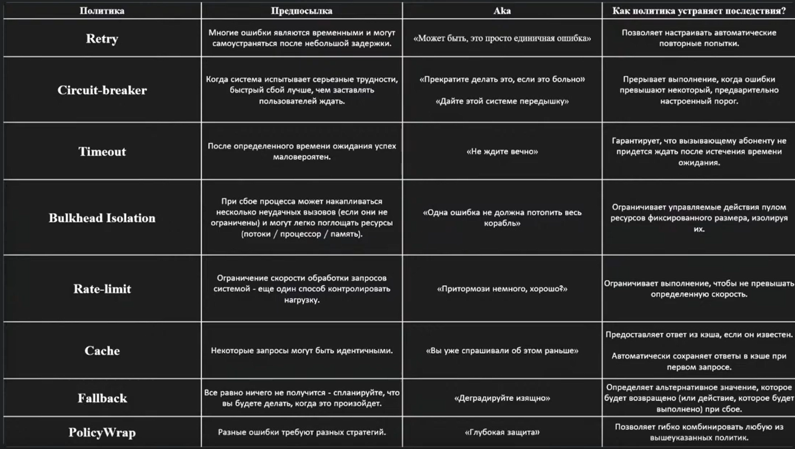

# [Polly](https://www.thepollyproject.org/)

 ### Polly - библиотек для обеспечения устойчисости .NET и обработки временных сбоев, позволяет применять такие политики как **повторная попытка**, **автоматический выключатель**, **тайм-аут**,**bulkhead isolation** и **резервное копирование** 


 ```Polly.Core ```

 ## Retry 
 ```c#
 // Единичный повтор
Policy
    .Handle<Exception>()
    .Retry();

// Многократное повторение
Policy
    .Handle<Exception>()
    .Retry(3);

// Многократное повторение + вызов заданного делегата перед каждым повтором
Policy
    .Handle<Exception>()
    .Retry(
        retryCount: 3, 
        OnRetry: (exception, retryCount) =>
        {
            // логика перед повторением
        });
    

// Многократное повторение + вызов заданного делегата перед каждым повтором с использование контекста политики
Policy
    .Handle<Exception>()
    .Retry(
        retryCount: 3, 
        OnRetry: (exception, retryCount, context) =>
        {
            // логика перед повторением
        });
    
// Бесконечное повторение до int.MaxValue
Policy
    .Handle<Exception>()
    .RetryForever();

 ```

```c#
// Повторение с различными промежутками времени
Policy
    .Handle<Exception>()
    .WaitAndRetry(new[]
    {
        TimeSpan.FromSeconds(1),
        TimeSpan.FromSeconds(2),
        TimeSpan.FromSeconds(3),
    });

// Повторение указанное количество раз с логикой увеличения промежутка времени
Policy
    .Handle<Exception>()
    .WaitAndRetry(5, retryAttempt => TimeSpan.FromSeconds(Math.Pow(2, retryAttempt)));

// Бесконечное повторение с логикой увеличения промежутка времени
Policy
    .Handle<Exception>()
    .WaitAndRetryForever(5, retryAttempt => TimeSpan.FromSeconds(Math.Pow(2, retryAttempt)));


```
## Circuit Breaker

```c#
// Разорвать цепь после некоторого количества последовательных исключений и 
// поддержать цепь разорванной в течении указанного врнмени
Policy
    .Handle<Exception>()
    .CircuitBreaker(2, TimeStamp.FromMinutes(1));

var breaker = Policy
                .Handle<Exception>()
                .CircuitBreaker(
                    2,
                    TimeStamp.FromMinutes(1),
                    onBreak: (exception, temespan, context) =>
                    {
                        // Действия, сразу после перехода цепи в Открытое состояние
                    },
                    onReset: context =>
                    {
                        // Действия, сразу после перехода цепи в Закрытое состояние
                    },
                    onHalfOpen: () =>
                    {
                        // Действия, сразу после перехода цепи в Полуоткрытое состояние (не совсем сразу, а после следующего запроса системы)
                    }
                );
// Получение текущего состояния системы
var state = breaker.CircuitState;
/*
    CircuitState.Closed
    CircuitState.Open
    CircuitState.HalfOpen
    CircuitState.Isolate
*/
// Перквести цепь в изолированное состояние
breaker.Isolate();
// Перквести цепь в Закрытое состояние в ручную, чтобы снова выполнять действия
breaker.Reset();

```

## Advanced Circuit Breaker

```c#
 var advancedCircuitBreakerPolicy = Policy
            .Handle<Exception>()
            .OrResult(r => _httpStatusCodesWorthRetrying.Contains(r.StatusCode))
            .AdvancedCircuitBreakerAsync(
                failureThreshold: 0.5, // если >= 50% Действий вызывают исключения
                samplingDuration: TimeSpan.FromSeconds(10), // зв 10 секундный период
                minimumThroughput: 10,  // так же происходит минимум 10 действий в этот период
                durationOfBreak: TimeSpan.FromSeconds(30), // размыкание цепи на 30 секунд
                onBreak: (delegateResult, breakDelay) =>
                {
                },
                onReset: () =>
                {
                },
                onHalfOpen: () =>
                {
                }
            );
```

## Timeout 
```c#
/*
    TimeoutStrategy.Optimistic
    TimeoutStrategy.Pessimistic
*/
// Отмена действий через 30 сек
var policy = Policy
    .Timeout(30, TimeoutStrategy.Optimistic);

var policy = Policy
    .Timeout(TimeSpan.FromMillesecomnds(2500));

var policy = Policy
    .Timeout(() => TimeSpan.FromMillesecomnds(2500));

var policy = Policy
    .Timeout(
        30, 
        onTimeout: (context, timespan, task) => 
        {
            // Логика по истичении времени
            // юю например
            task.ContinueWith(t =>
            {
                if(t.IsFaulet)
                {
                    Console.WriteLine(...)
                }
            });
        }

// ЕСЛИ ТАЙМАУТ ВЫБРАСЫВАЕТСЯ TimeoutRejectedException
```

## Bulkhead
Регулируя и изолируя ресурсы, шаблон Bulkhead представляет собой шаблон проектирования, который помогает минимизировать истощение ресурсов. Его название относится к перегородкам (переборкам), которые разделяют различные части корпуса корабля и предохраняют их от разрушения в случае прорыва. Шаблон Bulkhead в архитектуре программного обеспечения помогает предотвратить использование всех ресурсов одним разделом вашего приложения, что может привести к сбоям во всей системе.

```c#
using Polly;
using Polly.Bulkhead;
using System;

// Ограничивает паралельное выполнение действий
var bulkheadPolicy = Policy
    .Bulkhead(maxParallelization: 12);

// Ограничивает паралельное выполнение действий (всего 12 и 2 действия могут ожидать своей очереди)
var bulkheadPolicy = Policy
    .Bulkhead(maxParallelization: 12, maxQueuingActions: 2);

var freeQuerySlots = bulkHeadPolicy.QueueAvailableCount;
var freeExecutingSlots = bulkHeadPolicy.BulkheadAvailableCount;

var bulkheadPolicy = Policy
    .Bulkhead(12, context =>
    {
        // Логика, выполняемая после того как политика отклонила очередное действие
    });
    
// ЕСЛИ ВСЕ СЛОТЫ ЗАНЯТЫ ВЫБРАСЫВАЕТСЯ - BulkheadRejectedException
```
Определите код, который вы хотите защитить, с помощью политики Bulkhead. В этом примере мы создадим метод, который отправляет HTTP-запрос к внешнему API:
```c#
using System.Net.Http;
using System.Threading.Tasks;

public async Task<string> CallExternalApiAsync()
{
    return await bulkheadPolicy.ExecuteAsync(async () =>
    {
        var apiUrl = "https://api.example.com/data";
        using var httpClient = new HttpClient();
        var response = await httpClient.GetAsync(apiUrl);

        if (response.IsSuccessStatusCode)
        {
            var data = await response.Content.ReadAsStringAsync();
            return data;
        }
        else
        {
            return "API request failed";
        }
    });
}
```
**Создание устойчивых программ, которые могут корректно принимать сбои во внешних зависимостях, требует использования шаблона Bulkhead. Чтобы защитить важные ресурсы и избежать их истощения, вы можете быстро применить этот шаблон, используя Bulkhead Policy, предлагаемую Polly, в ваших .NET-приложениях.**

Имейте в виду, что Polly позволяет вам использовать различные шаблоны устойчивости, включая шаблон **Bulkhead**. Вы можете комбинировать его с другими политиками, такими как **Circuit Breaker** и **Retry** для создания устойчивых и надежных систем в зависимости от требований вашего приложения.

Для предоставления высококачественного программного обеспечения, способного выдерживать ограничения реальной производственной среды, необходимо использовать шаблоны устойчивости, такие как шаблон Bulkhead с Polly.

## Rate-Limit
Ограничение скорости — это метод, используемый для управления скоростью отправки запросов к серверу или API. Его часто используют для предотвращения злоупотреблений, защиты ресурсов и обеспечения справедливого использования. В этой статье мы рассмотрим, как реализовать ограничение скорости в C# с помощью класса SemaphoreSlim, и обсудим, как использовать ограничение скорости для повышения производительности и надежности ваших приложений.

```c#
// Политика допускает до 20 выполнений в 1 секунду
var rateLimitingPolicy = Policy
    .RateLimit(numberOfExecutions: 20, perTimeSpan: TimeSpan.FromSeconds(1));

// Политика допускает до 20 выполнений в 1 секунду с очередью из 10 действий
var rateLimitingPolicy = Policy
    .RateLimit(
        numberOfExecutions: 20, 
        perTimeSpan: TimeSpan.FromSeconds(1), 
        maxBurst: 10);

var rateLimitingPolicy = Policy
    .RateLimit(
        numberOfExecutions: 20, 
        perTimeSpan: TimeSpan.FromSeconds(1), 
        retryAfterFactory: (retryAfter, context) =>
        {
            // Делегат выполняемый при превышении скорости
            return retryAfter.Add(TimeSpan.FromSeconds(2));
        });
var rateLimitingPolicy = Policy
    .RateLimit(
        numberOfExecutions: 20, 
        perTimeSpan: TimeSpan.FromSeconds(1), 
        maxBurst: 10,
        retryAfterFactory: (retryAfter, context) =>
        {
            // Делегат выполняемый при превышении скорости
            return retryAfter.Add(TimeSpan.FromSeconds(2));
        });


 // Выбрасывает RateLimitRejectedException

```


#### Пример
```c#
var rateLimitingPolicy = Policy
    .RateLimit(5, TimeSpan.FromSeconds(10));
```
Теперь, когда мы создали политику ограничения скорости, мы можем использовать ее в приложении C# для управления скоростью входящих запросов. В этом примере мы будем моделировать входящие запросы, используя простой цикл, который отправляет HTTP-запросы к API. Мы будем использовать политику ограничения скорости, чтобы гарантировать, что в течение 10-секундного интервала будет выполнено не более пяти запросов.
```c#
    
// simulate incoming requests
for (int i = 0; i < 10; i++)
{
    // wait for the Rate Limiting policy to allow the request
    await rateLimitingPolicy.ExecuteAsync(async () =>
    {
        // make the HTTP request here
        using (var client = new HttpClient())
        {
            var response = await client.GetAsync("https://api.example.com");
            // process the response here
        }
    });
}
```
В этом примере мы создаем политику ограничения скорости, которая ограничивает скорость входящих запросов до 5 в течение 10-секундного интервала времени. Затем мы моделируем входящие запросы, используя простой цикл, который отправляет HTTP-запросы к API. Мы используем метод ExecuteAsync политики ограничения скорости, чтобы гарантировать, что в течение указанного интервала времени будет выполнено не более пяти запросов. Метод ExecuteAsync ожидает, пока политика ограничения скорости разрешит запрос, прежде чем отправлять HTTP-запрос.

## Cache

```c#
using Microsoft.Extensions.Caching.Memory;
using Polly;
using Polly.Caching.Memory;
using Polly.Timeout;

var memoryCache = new MemoryCache(new MemoryCacheOptions());
var memoryCacheProvider = new MemoryCacheProvider(memoryCache);

// Стратегия кэширования со стандартным временем жизни (но не RelativeTtl)
var cachePolicy = Policy.Cache(memoryCacheProvider, TimeSpan.FromMinutes(5));

// Стратегия кэширования, использующая абсолютное время жизни (срок жизни истекает в указанноге время)
var cachePolicy = Policy.Cache(memoryCacheProvider, new AbsoluteTtl(DateTimeOffset.Now.DateAddDay(1)));

// Стратегия кэширования, использующая плавающие время жизни (срок жизни элемента обновляется каждый раз, когда его запрашивают)
var cachePolicy = Policy.Cache(memoryCacheProvider, new SlidingTtl(TimeSpan.FromMinutes(5)));
...
var contex = new Context();
context[ContextualTtl.TimeSpanKey] = TimeSoan.FromMinutes(5);


var cachePolicy = Policy.Cache(
        cacheProvider: memoryCacheProvider, 
        ttl: TimeSpan.FromMinutes(5),
        onCacheError: (context, key, exception) =>
        {
            // Действие выполняемое при возникновении исключения в memoryCacheProvider
        });
// Сначала пытвемся получить значение из кэша, если удалось возвращаем результат, если нет , то выполняем заданный делегат        
var s = cachePolicy.Execute((context, cancellationToken) => 
{
    var key = context.OperationKey;
    return key; 
}
, context, default);
```

## Fallback
Резервная стратегия реактивной устойчивости обеспечивает замену в случае сбоя выполнения обратного вызова. Сбой может быть либо Исключением, либо объектом результата, указывающим на неудачную обработку. Обычно эта стратегия используется в качестве крайней меры, то есть, если все другие стратегии не смогли преодолеть временный сбой, вы все равно можете предоставить вызывающей стороне резервное значение.

```c#
public class ResiliencePolicies
    {
    public IAsyncPolicy GetFallback()
    {
        return Policy
            .Handle<BrokenCircuitException>()
            .FallbackAsync(
                fallbackAction: FallbackAction, 
                onFallbackAsync: OnFallbackAsync);
    }
    private Task OnFallbackAsync(Exception exception)
    {
        Console.WriteLine("About to call the fallback action. This is a good place to do some logging");
        return Task.CompletedTask;
    }
    private Task FallbackAction(CancellationToken cancellationToken)
    {
        Console.WriteLine("Fallback action is executing");
        return Task.CompletedTask;
    }
```

## Wrap

```c#
using System.Net;
using Polly;
using Polly.Extensions.Http;

var builder = WebApplication.CreateBuilder(args);

IAsyncPolicy<HttpResponseMessage> httpRetryPolicy = HttpPolicyExtensions
    .HandleTransientHttpError()
    .WaitAndRetryAsync(3, retryAttempt => TimeSpan.FromSeconds(retryAttempt));

IAsyncPolicy<HttpResponseMessage> httpRequestFallbackPolicy = 
    HttpPolicyExtensions.HandleTransientHttpError()
    .FallbackAsync(new HttpResponseMessage(HttpStatusCode.OK)
    {
        Content = new StringContent("-1")
    });

IAsyncPolicy<HttpResponseMessage> retryAndFallbackWrap = 
    Policy.WrapAsync(httpRequestFallbackPolicy, httpRetryPolicy);

builder.Services.AddSingleton(retryAndFallbackWrap);

var app = builder.Build();

int requestCount = 0;
// Endpoint that fails 100% of the time
app.MapGet("/Inventory/{id}", (int id) =>
{
    Console.WriteLine($"{++requestCount} Something went wrong");
    return Results.Problem("Something went wrong");
});

HttpClient httpClient = new HttpClient()
{
    BaseAddress = new Uri("http://localhost:5000")
};

// Endpoint that takes a Polly Policy by DI
app.MapGet("/Catalog/{id}", async (int id, IAsyncPolicy<HttpResponseMessage> policy) =>
{
    string requestEndpoint = $"Inventory/{id}";
    HttpResponseMessage response = await policy.ExecuteAsync(() =>
    httpClient.GetAsync(requestEndpoint));

    if (response.IsSuccessStatusCode)
    {
        int itemsInStock = await response.Content.ReadFromJsonAsync<int>();
        return Results.Ok(itemsInStock);
    }
    return Results.Problem("Something went calling the inventory");
});

app.Run();
```

## Пример

#### ШАГ 1: ПАКЕТЫ NUGET

Вам нужны следующие пакеты:
```
    Polly
    Microsoft.Extensions.Http.Polly
```

#### ШАГ 2. НАСТРОЙКА IHttpClientBuilder И ПОЛИТИКИ POLLY ПРИ ЗАПУСКЕ

В файле start.cs добавьте HttpClient к службам и настройте политики повтора, а затем оберните политики повтора политикой тайм-аута. Это пример из файла start.cs:
```c#
public static IHostBuilder CreateHostBuilder(string[] args)
{
  var host = Host.CreateDefaultBuilder(args);
  host.ConfigureServices((hostContext, services) =>
  {
    // ...
    // ...
    services.AddHttpClient("HttpClient")
      .AddPolicyHandler(GetRetryPolicy())
      .AddPolicyHandler(Policy.TimeoutAsync<HttpResponseMessage>(5));
    });
    // ...
    // ...
  } 
  return host;
}
 
private static IAsyncPolicy<HttpResponseMessage> GetRetryPolicy()
{
  return HttpPolicyExtensions
    .HandleTransientHttpError()
    .Or<TimeoutRejectedException>()
    .WaitAndRetryAsync(3, retryAttempt => TimeSpan.FromSeconds(30));
}
```
Что тут происходит?

Services.AddHttpClient создает новый HttpClient.

Первый добавленный обработчик политики — это политика повтора. Обратите внимание, что политика повтора также будет повторять попытки TimeoutRejectedExceptions. Эта политика повторных попыток будет повторять попытку 3 раза с задержкой в ​​30 секунд.

Следующий обработчик политики — это обработчик таймаута. Этот обработчик выдаст исключение TimeoutRejectedException, если вызываемый URL-адрес не отвечает в течение 5 секунд.

#### ШАГ 3. ИСПОЛЬЗУЙТЕ IHttpClientFactory В ВЫЗЫВАЮЩЕМ КЛАССЕ

В классе нет кода Polly, который выполняет http-вызовы:
```c#
namespace MyCode
{
  public class MyClass
  {
    private readonly IHttpClientFactory _clientFactory;
  
    public MyClass(IHttpClientFactory clientFactory)
    {
      _clientFactory = clientFactory;
    }
  
    public async Task<string> Get(string url)
    {
      string authUserName = "user";
      string authPassword = "password";
  
      var httpClient = _clientFactory.CreateClient("HttpClient");
      // If you do not have basic authentication, you may skip these lines
      var authToken = Encoding.ASCII.GetBytes($"{authUserName}:{authPassword}");
      httpClient.DefaultRequestHeaders.Authorization = new System.Net.Http.Headers.AuthenticationHeaderValue("Basic", Convert.ToBase64String(authToken));
  
      // The actual Get method
      using (var result = await httpClient.GetAsync($"{url}"))
      {
        string content = await result.Content.ReadAsStringAsync();
        return content;
      }
    }
  }
}
```
httpClient.GetAsync() автоматически повторит вызов, если произойдет какое-либо из условий, описанных в GetRetryPolicy(). Он вернется только после того, как вызов будет успешным или будет достигнуто количество повторов.

**ПРИМЕЧАНИЕ: НЕ УСТАНАВЛИВАЙТЕ HttpClient.Timeout**

HttpClient.Timeout установит глобальный тайм-аут, то есть общий тайм-аут, включая повторные попытки опроса. Поэтому, если вы установите этот таймаут, вы получите TaskCanceledException или OperationCanceledException вместо TimeoutRejectedException, и эти исключения не могут быть перехвачены политикой таймаута.
