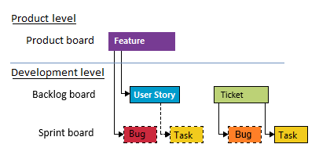

 

При продуктовой разработке Product Manager (PM) создает фичи на продуктовой борде. Дев менеджер обсуждая с командой работу, декомпозирует фичу в User Stories и линкует их как Child-ы к Feature. User Stories будут трэкаться на бэклог борде. Для конкретизации работы, ответственный за User Story должен (но не обязательно для оцененных сторей в 1, 2, 3, 5 стори поинтов) создать задачи (Task) и прилинковать их как Child-ы к User Story. Такие задачи можно будет трэкать на спринтовой борде. После выдачи реализованного функционала QC, тестировщики могут создать баги (Bug) и прикрепить их к Feature как Child-ы, которые также можно трэкать на спринтовой борде.

В случае с поддержкой продукта, команда работает над тикетом (Issue/Escalation). Тикет назначается на Дев манеджера, в свою очередь который может переназначить тикет на другого члена команды. Тикеты трэкаются на бэклог борде. При изучении (ресерче) тикета, назначенный человек должен обязательно создать таску в текущей итерации, прилинковать таску к тикету как Child и списывать часы в нее. Если QC удалось наиграть проблему из тикета и в итоге создана бага (как Child к тикету), то разработчик, работая над багой, должен уже списывать свои часы в эту багу.

# Mandatory User Story/Ticket fields
`Completed Work [Dev] (Netwrix Auditor) | Time Spent (1Secure)` - Фактическое затраченое время в часах. Может проставляться ответсвенным за этот айтем по ходу выполнения работы или Дев менеджером при закрытии Таски/Баги если таковые имеются (см ниже). Изменение в состояниях: Active -> Resolved (Column: In Progress -> Done)

`Iteration` - Итерация, в которой ведется работа по текущему айтему. Проставляется Дев менеджером. Первоначальное значение - корневая итерация. Изменение в состояниях: New (Column: Queued -> Ready To Start)

`Assigned To` - Ответственный разработчик этого айтема. При создании User Story, это поле остается не заданным (Unassigned). Проставляется Дев менеджером на Sprint/Weekly planning-е. Изменение в состояниях: New (User Story), Active/Awaiting Dev (Тикет) (Column: Queued -> Ready To Start). После завершения тикета Дев менеджер переводит айтем на QC менеджера (Column: In Progress -> Done).

# Mandatory User Story fields
`TechArea (Netwrix Auditor)` - В основном тоже самое что и Area. Значение этого поля используется для группировки нашей allocation в репортинг-портале . Проставляется тем кто создал User Story. Изменение в состояниях: New

`User Story type (Netwrix Auditor)` - Тип User Story. Проставляется тем кто создал User Story. Изменение в состояниях: New.
Имеет 3 опции:

- `PR` - Расшифровывается как "Product Release". Любая активность привязанная к продуктовым фичам текущего релиза.
Regular - Любого плана активность, не привязанная к текущему релизному скоупу и саппорту. Это могут быть: любого плана тех долг, создание\апдейт лаб, рефакторинг и т.д.
- `Escalation` - Не используется в нашей команде
- `Story Points` - Сложность User Story. Возможные значения: 1, 2, 3, 5, 8, 12. Можно приравнивать приблизительно к количествам дням, которое потребуется для выполнения этой User Story. Выставляется Дев менеджером на Weekly или Sprint planning-е с участем всей команды. Изменение в состояниях: New (Column: Queued -> Ready To Start)

`Original Estimate (Netwrix Auditor) | Estimated Effort (Hours) (1Secure)` - Оценочное время в часах, которое планируется потратить на эту User Story. Выставляется членом команды, на которого назначена User Story. Изменение в состояниях: New -> Active (Column: Ready To Start -> In Progress)

# Mandatory Ticket fields
`Dev Owner (Netwrix Auditor)` - Ответственный разработчик, который будет исследовать и фиксить тикет. Выставляется Дев менеджером. Изменение в состояниях: Active (Column: Ready To Start -> In Progress)

`State (1Secure)` - Состояние тикета. Выставляется членом команды, на которого назначен Escalation. (Столбцы продуктовой борды не отражают точное значение состояния)
Возможные изменения значения:

- `Awaiting Support` - ожидается ответ от суппорта (Column: Queued)
- `Awaiting Dev` - разработка занимается исследованием тикета (Column: Ready To Start)
- `Awaiting Fix` - разработка знаимается фиксом проблемы (Column: In Progress)
- `Active` - разработка выполнила свою работу, переводится на QC инженера (Column: Done)

# Mandatory Task/Bug fields
`Completed [Work Dev] (Netwrix Auditor) | Time Spent (1Secure)` - Фактическое затраченое время в часах. Выставляется членом команды, на которого назначен баг по ходы выполнения работы. Изменение в состояниях: Active -> Resolved. Обновление Completed Work в User Story/Тикете вносятся только в момент перевода задачи в Closed (в Resolved для багов прилинкованных к тикетам) Дев менеджером на weekly planning или разработчиком.

`Iteration` - Итерация, в которой ведется работа по текущему айтему. Проставляется тем кто создал задачу. Изменение в состояниях: New

`Activity` - Тип работы айтема. Проставляется тем кто создал задачу и только для айтемов, созданных в рамках тикета (Значение Escalation). Изменение в состояниях: New

# Mandatory Task/Bug fields
`Completed [Work Dev]` - Фактическое затраченое время в часах. Выставляется членом команды, на которого назначен баг по ходы выполнения работы. Изменение в состояниях: Active -> Resolved. Обновление Completed Work в User Story/Тикете вносятся только в момент перевода задачи в Closed (в Resolved для багов прилинкованных к тикетам) Дев менеджером (на weekly planning) или разработчиком.

`Iteration` - Итерация, в которой ведется работа по текущему айтему. Проставляется тем кто создал задачу. Итерация должна быть задана на тот спринт, в котором планируется выполнение задачи. Изменение в состояниях: New

`Activity` - Тип работы айтема. Проставляется тем кто создал задачу и только для айтемов, созданных в рамках тикета (Значение Escalation). Изменение в состояниях: New

`Assigned To` - Ответственный разработчик этого айтема. При создании задачи, разработчик должен перевести ее на себя. Для бага проставляется Дев менеджером согласно процессу. Есть возможность переводить на себя баги самостоятельно без уведомления Дев менеджера:

- если бага прикреплена к тикету, и этот разработчик ответственный за тикет
- если бага создана в рамках тестируемой фичи, над которой работал разработчик в этом спринте
